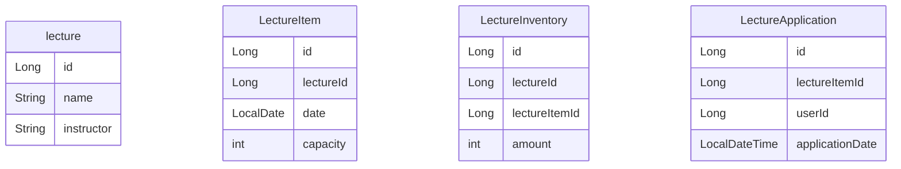

## 설계한 테이블에 대한 ERD 및 이유를 설명
### ERD

### 설계 이유
서로 독립적이면서도 필요한 정보를 연관 지을수 있는 방식으로 설계했습니다.

### 테이블 별 설명
lecture 테이블 (강의정보)
- 여러 날짜에 걸쳐 동일한 특강이 진행될 수 있어서 각 특강의 고유 정보를 관리하는 테이블

lectureItem 테이블 (특정 날짜의 강의 일정)
- 특강이 여러 날에 결처 진행될 수 있어서 특강 일정 및 수용 인원을 구분해 관리하는 테이블

lectureInventory 테이블(특강 일정에 따른 신청 가능 수량)
- 신청 가능 인원을 확인하고 해당 인원이 초과되지 않도록 신청을 제어하기 위한 테이블

lectureApplication 테이블 (특강 신청 기록)
- 사용자가 어떤 강의에 신청했는지 기록하고 중복 신청을 방지하며 이후 신청 내역 조회하기 위한 테이블

